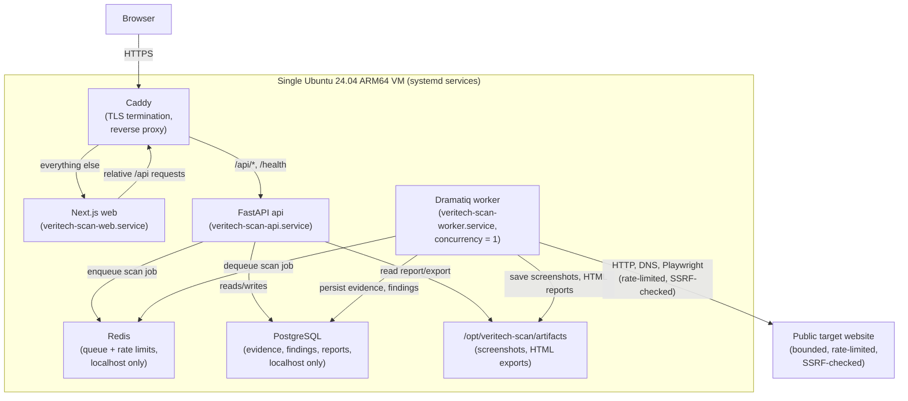

# Architecture

Veritech Scan is a monorepo with three runtime apps — a Next.js frontend, a
FastAPI API, and a Dramatiq worker — sharing one PostgreSQL database and one
Redis instance, all behind a single Caddy reverse proxy. Everything runs as
native systemd services on one Oracle Cloud Always Free ARM64 VM in
production — no Docker or containers anywhere in the stack.

## System diagram

## Why a background worker is required

A scan does bounded but genuinely slow, multi-step network I/O: an HTTP
fetch with manual redirect revalidation, robots.txt/sitemap retrieval, a
same-origin crawl of up to 50 pages at one request per 1.5 seconds, six DNS
lookups, a headless Chromium render, and (optionally) a PageSpeed Insights
call — all bounded by a 10-minute total scan timeout. That easily exceeds
any reasonable HTTP request/response cycle, so:

- **The API must return immediately** after validating the target and
  creating the `scan_requests` row, or the browser tab (and any reverse
  proxy timeout) would hang for minutes.
- **Dramatiq + Redis** decouples "a scan was requested" from "a scan is
  running." The API enqueues one message; the worker picks it up on its own
  schedule.
- **Worker concurrency is deliberately 1** (`SCAN_WORKER_CONCURRENCY=1`).
  Playwright/Chromium is memory-hungry, and the Oracle Free Tier ARM VM has
  a small, fixed memory budget — running scans one at a time is a conscious
  trade-off of throughput for staying within free-tier resource limits
  without OOM-killing the host.
- **The frontend polls**, rather than holding a connection open, using
  TanStack Query's `refetchInterval` against `GET /scans/{id}` and
  `GET /scans/{id}/report` while status is `queued` or `running`.

## Collection flow

`app/tasks/scan_tasks.py` is the orchestrator. `run_scan(scan_id)` runs each
collection area in a fixed sequence — HTTP checks, robots/sitemap, crawl,
DNS/email posture, browser render, technology detection, performance, then
the rules engine — via `_run_job`, which:

1. Marks the corresponding `scan_jobs` row `running`.
2. Calls the collector function with up to `MAX_ATTEMPTS = 2` tries.
3. On success, marks the job `succeeded` and records a `scan_events` row.
4. On permanent failure, marks the job `failed`, records the error, and
   **the orchestrator continues to the next collection area** — one
   collector failing never aborts the whole scan (see
   `determine_scan_status` in `app/tasks/scan_tasks.py`, covered by
   `tests/backend/test_scan_status.py`).

A wall-clock deadline (`SCAN_MAX_TOTAL_MINUTES`, default 10) is checked
before starting each remaining collection area; once it passes, remaining
areas are skipped (their `scan_jobs` rows stay `pending`) and the rules
engine still runs against whatever evidence exists.

## Evidence flow

Collectors never write "findings" directly. Each one persists into its own
typed observation table (`http_observations`, `dns_observations`,
`pages`, `technology_observations`, `performance_observations`,
`third_party_dependencies`) **and** one or more normalized `evidence_items`
rows — the product's actual core data model (see
`apps/api/app/models/evidence.py`). An evidence item always has a
`category`, `source_type`, `confidence`, a `normalized_payload_json`, and a
`human_readable_summary`. Raw HTTP responses are never stored as the primary
record; screenshots and generated report HTML go to the artifact storage
directory (`ARTIFACT_STORAGE_LOCAL_PATH`) through `ArtifactStorage`
(`apps/api/app/services/artifact_storage.py`), referenced by path, not
embedded in Postgres.

## Rules engine flow

After collection, `run_rules_engine(db, scan)` (`apps/api/app/rules/engine.py`)
builds a `RuleContext` from the observation tables + evidence items already
persisted, runs every registered deterministic rule function against it, and
persists a `Finding` + `FindingEvidence` row per match — always citing the
real evidence item ID(s) that justified it. See `docs/rules-engine.md`.

## Report output

`GET /scans/{id}/report` (`apps/api/app/services/report_builder.py`) builds
a `ReportOut` by re-querying findings + observations for the scan. The same
`ReportOut` is rendered to HTML by
`apps/api/app/templates/report.html.jinja` for `GET /scans/{id}/export/html`
— a self-contained, print-friendly page (a "Print / Save as PDF" button is
the only script on the page). The orchestrator also generates and saves this
HTML to the artifact storage directory and a `reports` row when a scan
finishes, so the export doesn't have to be regenerated from a stale
evidence set.

## Why Postgres/Redis/worker are never publicly exposed

PostgreSQL and Redis are configured (by `scripts/install-server.sh`) to
`bind` to `127.0.0.1` only at the daemon level — not merely left off a
`ports:` list, since there's no container network to rely on for isolation
anymore. The Dramatiq worker listens on no network port at all; it only
pulls from Redis. Only Caddy binds host ports 80/443. UFW is configured to
allow only SSH/HTTP/HTTPS as defense in depth on top of the bind-address
restriction — see `docs/threat-model.md`.
